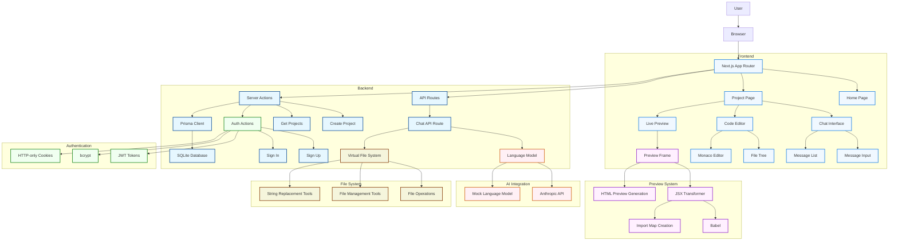

# Project Architecture Diagram

## Architecture Overview

### Frontend
- **Home Page**: Landing page with sign-in/sign-up options
- **Project Page**: Main interface for project development
- **Chat Interface**: AI chat interaction with message history
- **Code Editor**: Monaco Editor for file management and editing
- **Live Preview**: Iframe showing rendered React components

### Backend
- **API Routes**: Next.js API endpoints (chat endpoint with Vercel AI SDK)
- **Server Actions**: Direct database operations from React components
- **Prisma Client**: Auto-generated database query builder
- **SQLite Database**: Local database for user and project data

### AI Integration
- **Language Model**: Either Anthropic API (with API key) or mock model (for demo)
- **Mock Language Model**: Generates static components (Counter, Form, Card) without AI

### File System
- **Virtual File System**: In-memory file management for project files
- **File Management Tools**: Rename, delete operations for virtual files
- **String Replacement Tools**: Search and replace operations in files

### Preview System
- **JSX Transformer**: Babel-based transformation of JSX/TypeScript files
- **Import Map Creation**: Handles module resolution for preview
- **HTML Preview Generation**: Creates iframe content with CSS and scripts

### Authentication
- **JWT Tokens**: Session management using JSON Web Tokens
- **bcrypt**: Password hashing for secure storage
- **HTTP-only Cookies**: Secure session cookies (http-only, secure in production)

## Data Flow

1. User interacts with chat interface
2. Message sent to chat API endpoint
3. AI model generates response with tool calls
4. Tools modify virtual file system
5. File system changes are reflected in code editor
6. Preview system transforms and renders components
7. Changes are saved to database (if user is authenticated)